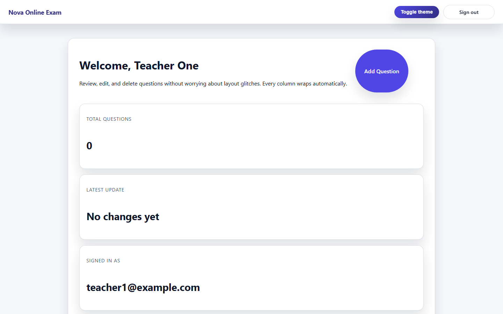
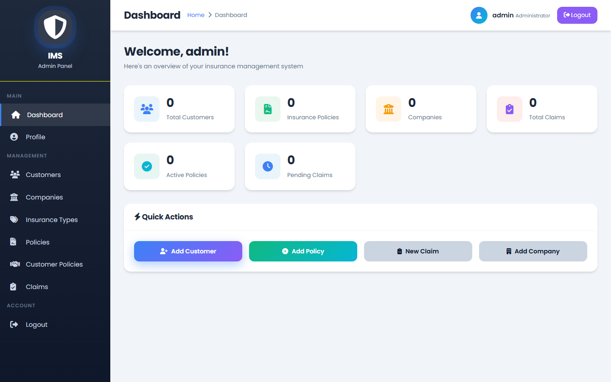

# Milan Goswami — Software Developer Portfolio

<div align="center">


**An interactive, engineering-focused personal portfolio website showcasing Java backend architectures, full-stack web applications, academic milestones, and verified credentials.**

[Overview](#overview) • [Key Features](#key-features) • [Tech Stack](#technology-stack) • [Projects](#featured-projects) • [Credentials](#academic-progression--verified-credentials) • [Structure](#project-structure) • [Getting Started](#getting-started) • [Deployment](#deployment) • [Contact](#contact--profiles)

</div>

---

## 📌 Overview

This repository houses the personal developer portfolio of **Milan Goswami**, an MCA student and Software Developer based in Pune, India, specializing in Java, backend development, and scalable full-stack applications.

The portfolio is designed with an editorial, dark-first art direction and built on modern web standards. It delivers an interactive user experience combining custom GSAP scroll sequences, an atmospheric HTML5 canvas particle system, a zero-flash dual-theme engine, an in-browser PDF resume reader, and modal credential viewers.

---

## ✨ Key Features

- **Dual-Theme Engine (Dark Mode Default):**
  - **First-Visit Default:** Arriving visitors immediately see a premium Dark Mode palette (`#0C0F0C` canvas) with zero white flashes (FOUC), enabled by an inline parser-blocking bootstrap script in `<head>`.
  - **Persistent Manual Toggle:** Users can switch to Light Mode (`#F8F9F5`) at any time. Choices are saved to `localStorage` and respected across reloads without forcing users back to dark mode.
  - **Dynamic Theme Transitions:** CSS custom properties smoothly interpolate over 280ms while triggering real-time canvas ambient particle recalibrations.

- **Real In-Browser Resume Viewer:**
  - Integrated modal viewer for Milan's authentic resume PDF (`milan-goswami-resume.pdf`).
  - Supports zoom controls, fit-to-width viewing, print options, and direct one-click PDF downloading.

- **Interactive Project Showroom:**
  - Deep-dive presentation for featured applications with tab-based stage navigation.
  - Interactive multi-screen screenshot previews, architectural breakdowns, technology tags, and direct GitHub repository links.

- **Currently Learning Constellation:**
  - An interactive 6-node roadmap highlighting active study areas (Spring Boot, Spring Data JPA, REST APIs, System Design, Microservices, and DSA).
  - Features orbital paths, focused inspection states, and dedicated touch-friendly mobile layouts.

- **Academic Progression & Verified Credentials Deck:**
  - Visual timeline detailing academic milestones from BCA (Surat) to MCA (Pune).
  - Interactive credentials deck with verified credential IDs and modal previews for certificates from **HackerRank**, **Apna College**, **Intel Unnati**, and hackathons.

- **Atmospheric Canvas & Micro-Interactions:**
  - Subtle, mouse-reactive ambient particle bloom in the Hero section implemented via lightweight HTML5 Canvas.
  - Infinite auto-scrolling tech marquee ribbon that pauses only when an individual technology item is hovered.
  - Butter-smooth inertia scrolling powered by **Lenis** synchronized with **GSAP ScrollTrigger**.

- **100% Responsive Architecture:**
  - Thoroughly audited and optimized across 9 standard device viewports (from 360px Android devices up to 1536px wide displays).
  - Includes a mobile navigation drawer with complete keyboard focus management and zero horizontal overflow.

---

## 🛠️ Technology Stack

| Category | Technologies & Tools |
|:---|:---|
| **Frontend Framework** | [React 19](https://react.dev/) (Functional Components, Custom Hooks) |
| **Build & Bundling** | [Vite 8](https://vitejs.dev/) with `@vitejs/plugin-react` |
| **Motion & Scroll Physics** | [GSAP 3](https://greensock.com/gsap/) (`ScrollTrigger`), [Motion](https://motion.dev/), [Lenis](https://lenis.darkroom.engineering/) |
| **Icons & Typography** | [Lucide React](https://lucide.dev/), Google Fonts (*Plus Jakarta Sans*, *Inter*, *Playfair Display*) |
| **Code Quality** | [Oxlint](https://oxc.rs/docs/guide/usage/linter.html) (Fast Rust-based JavaScript/React linter) |
| **Featured Project Stacks** | Java, Spring Boot, JSP, Servlets, JDBC, MySQL, Apache Tomcat, Maven |

---

## 🚀 Featured Projects

### 1. Nova Online Examination System
A comprehensive Java web application designed for conducting secure online examinations, managing question banks, student enrollments, and real-time result evaluation.

- **Tech Stack:** Java, JSP, Servlets, MySQL, Maven, Apache Tomcat, HTML/CSS/JavaScript
- **Source Code:** [GitHub Repository](https://github.com/Milan-Goswami/NovaOnlineExamSystem)
- **Preview:**

<div align="center">
  
</div>

---

### 2. Insurance Management System
A full-stack J2EE web application providing an administrative dashboard to oversee policy lifecycles, customer portfolios, and insurance claim processing workflows.

- **Tech Stack:** Java, JSP, Servlets, MySQL, JDBC, HTML/CSS
- **Source Code:** [GitHub Repository](https://github.com/Milan-Goswami/Insurance-Management-System)
- **Preview:**

<div align="center">
  
</div>

---

## 🎓 Academic Progression & Verified Credentials

### Education
- **Master of Computer Applications (MCA):** Dr. D. Y. Patil Vidyapeeth, Pune *(2025 — Present)*
- **Bachelor of Computer Applications (BCA):** Sutex Bank College of Computer Applications & Science, Surat *(2022 — 2025)*

### Verified Certifications
| Credential Name | Issuer / Organization | Credential ID / Scope |
|:---|:---|:---|
| **Java (Basic)** | HackerRank | `F73C10A493B6` |
| **DSA with Java (Alpha)** | Apna College | `6a523c913ed3668974013c4e` |
| **Intel Unnati AI Program** | Intel Corporation & DPU | Participation Certificate |
| **InnoHack 2.0 Hackathon** | Dr. D. Y. Patil Vidyapeeth | Competition Certificate |
| **INNIXO Hackathon (Hacksphere 1.0)** | Unstop & DPU | Hackathon Certificate |

---

## 📂 Project Structure

```text
Portfolio/
├── public/                                  # Static runtime assets
│   ├── assets/                              # Featured project screenshots
│   │   ├── insurance-customers.png
│   │   ├── insurance-dashboard.png
│   │   ├── insurance-home.png
│   │   ├── nova-dashboard.png
│   │   ├── nova-exam-interface.png
│   │   └── nova-home.png
│   ├── certificates/                        # High-resolution credentials
│   │   ├── Certificate of Appreciation_page-0001.jpg
│   │   ├── INNIXO_hackathon_certifictae.jpg
│   │   ├── innohack_milan_certificat.png
│   │   ├── Intel_unnati_certificate.png
│   │   └── Java_basic_certificate.png
│   ├── favicon.svg                          # Site favicon
│   ├── icons.svg                            # Sprite icons
│   └── milan-goswami-resume.pdf             # Real resume PDF asset
├── src/                                     # Application source code
│   ├── assets/                              # Component image & certificate assets
│   ├── components/                          # Modular React UI components
│   │   ├── CertificateModal.jsx             # Credential light-box modal
│   │   ├── ContactCTA.jsx                   # Closing action section
│   │   ├── CurrentlyLearning.jsx            # 6-node learning constellation
│   │   ├── Experience.jsx                   # Education & credentials deck
│   │   ├── Footer.jsx                       # Colophon, telemetry & social links
│   │   ├── Hero.jsx                         # Hero stage & ambient canvas
│   │   ├── Navbar.jsx                       # Navigation header & mobile drawer
│   │   ├── Projects.jsx                     # Interactive project showroom
│   │   ├── ResumeModal.jsx                  # Authentic PDF resume reader
│   │   ├── TechIcons.jsx                    # Authentic tech vector icons
│   │   ├── TechStack.jsx                    # Infinite auto-scrolling marquee
│   │   └── ThemeToggle.jsx                  # Accessible theme switch button
│   ├── data/                                # Data models & metadata
│   │   ├── portfolio.js                     # Projects, bio & timeline data
│   │   └── techMeta.jsx                     # Tech stack dictionary & SVGs
│   ├── hooks/                               # Custom hooks
│   │   └── useTheme.js                      # Theme state, events & storage
│   ├── styles/                              # Design system style sheets
│   │   ├── global.css                       # Base layout & font configurations
│   │   ├── themes.css                       # Light & Dark design tokens
│   │   └── variables.css                    # Structural & glass tokens
│   ├── App.jsx                              # Main application orchestrator
│   └── main.jsx                             # React DOM entry point
├── .gitignore                               # Production gitignore rules
├── .oxlintrc.json                           # Oxlint configuration
├── index.html                               # Entry HTML with dark-mode bootstrap
├── package.json                             # Dependencies & scripts
├── package-lock.json                        # Exact dependency lockfile
├── README.md                                # Project documentation
└── vite.config.js                           # Vite configuration
```

---

## ⚡ Getting Started

### Prerequisites
- **Node.js:** `^20.19.0` or `>=22.12.0` (required by Vite 8; LTS recommended)
- **npm:** `v9.0.0` or higher (bundled with Node.js)

### Installation

1. **Clone the repository:**
   ```bash
   git clone https://github.com/Milan-Goswami/Portfolio.git
   cd Portfolio
   ```

2. **Install dependencies:**
   ```bash
   npm install
   ```
   *(or use `npm ci` for an exact reproducible install from `package-lock.json`)*

### Development

Run the local Vite development server with Hot Module Replacement (HMR):
```bash
npm run dev
```
Open [http://localhost:5173](http://localhost:5173) in your browser.

### Quality & Linting

Run Oxlint to check code quality:
```bash
npm run lint
```

### Production Build

Create an optimized static distribution in `dist/`:
```bash
npm run build
```

Preview the production build locally:
```bash
npm run preview
```

---

## 🚢 Deployment

Because this project is a static Single Page Application (SPA), it can be deployed to any modern web hosting service.

### Option 1: Vercel (Recommended)
1. Push your repository to GitHub.
2. Import the project on [Vercel](https://vercel.com/).
3. Vercel auto-detects Vite:
   - **Build Command:** `npm run build`
   - **Output Directory:** `dist`
4. Click **Deploy**.

### Option 2: Netlify
1. Connect your repository on [Netlify](https://www.netlify.com/).
2. Set the build settings:
   - **Build Command:** `npm run build`
   - **Publish Directory:** `dist`
3. Click **Deploy Site**.

### Option 3: GitHub Pages
You can deploy using GitHub Actions with a standard workflow that runs `npm ci && npm run build` and uploads the `dist/` directory via `actions/deploy-pages`.

---

## 📬 Contact & Profiles

- **Email:** [milangoswami879@gmail.com](mailto:milangoswami879@gmail.com)
- **GitHub:** [@Milan-Goswami](https://github.com/Milan-Goswami)
- **LinkedIn:** [linkedin.com/in/milan-goswami01](https://www.linkedin.com/in/milan-goswami01/)
- **LeetCode:** [leetcode.com/u/pro_milan](https://leetcode.com/u/pro_milan/)

---

## 📄 License

This portfolio project is open source and licensed under the [MIT License](https://opensource.org/licenses/MIT).
Feel free to explore the code, draw inspiration, or adapt design patterns for your own projects.
